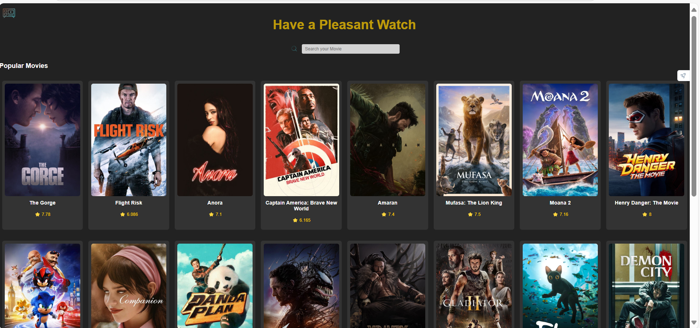

# Movie App

This is a Trending Movie App that fetches and displays popular movies using an API.

## Technologies Used
- Frontend: HTML, CSS, JavaScript, API integration
- Framework: React (with Vite)
- Package Manager: npm
- Styling: CSS
- Linting: ESLint
- Build Tool: Vite

## Features
- Fetches and displays trending movies using an API
- Search functionality to find movies by title
- Responsive design for mobile and desktop users
- Movie details page with additional information

## Installation
1. Clone the repository:
   ```bash
   git clone https://github.com/your-username/Trending-Movie.git

2. Navigate to the project folder:
   ```bash
   cd Trending-Movie
   ```
   3. Install dependencies:
   ```bash
   npm install
   ```
4. Run the app:
   ```bash
   npm run dev
   ```
## API Integration
This project uses an external API to fetch movie data. Make sure to configure your API key inside the project.

## Contributing
Feel free to submit pull requests to improve the project!

## License
This project is licensed under the MIT License.
